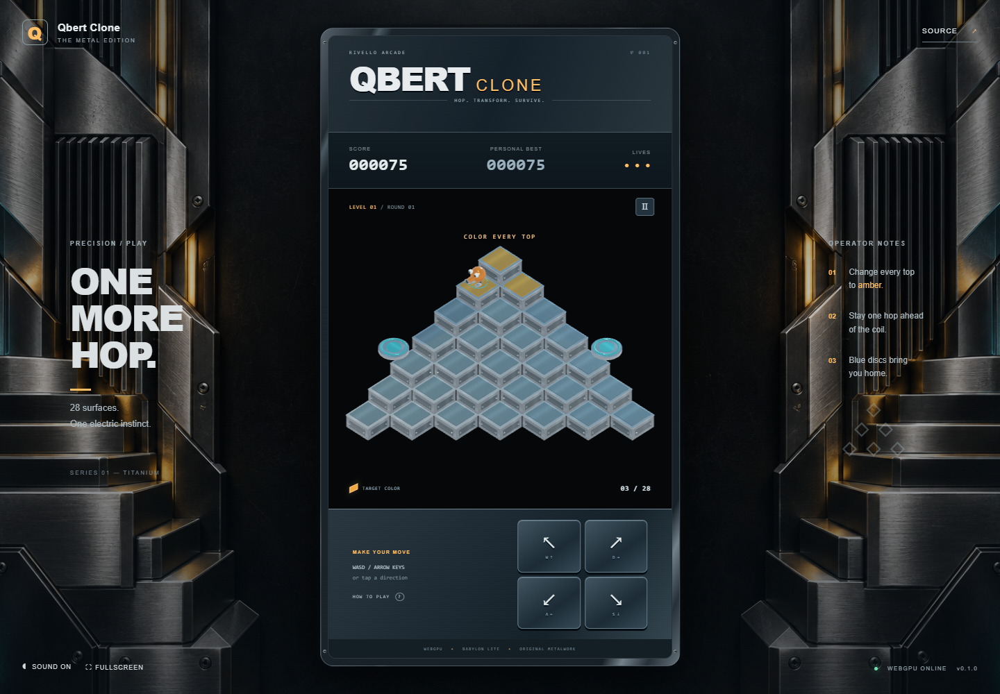

# Qbert Clone

A complete browser arcade game inspired by Q*bert, rebuilt as an original metal machine. Hop across a 28-tile pyramid, turn every top amber, dodge enemies and ride rescue discs back to the summit. Rendered with **Babylon Lite and WebGPU** in a fixed 9:16 portrait cabinet, surrounded by original metallic artwork.

## Live Demo

**[Play Qbert Clone](https://samuelasherrivello.github.io/babylon-lite-qbert-clone/)** · [Latest release](https://github.com/SamuelAsherRivello/babylon-lite-qbert-clone/releases/latest)

Use a current WebGPU-capable browser with hardware acceleration enabled. Chrome or Edge is recommended. The game reports unavailable graphics adapters and offers a retry; it does not silently substitute another renderer.

## Images

[](qbert-clone/documentation/screenshot01.png)

## How to Play

| Hop | Keyboard | Virtual button |
|---|---|---|
| Upper left | W or ↑ | ↖ |
| Upper right | D or → | ↗ |
| Lower left | A or ← | ↙ |
| Lower right | S or ↓ | ↘ |

- Turn all **28 tile tops amber** to finish a round. Four rounds advance a level.
- Level 1: one hop colors a tile. Level 2: two hops. Level 3: revisiting a completed tile reverts it. Later levels combine two-hop and reverting rules.
- Red balls, purple eggs/coils and silver side climbers are dangerous. Eggs hatch into a snake that pursues you.
- Catch green balls to freeze enemies for four seconds. Catch green gremlins for 300 points before they erase your tiles.
- Hop outward from either blue disc at row five to return to the summit. Each disc works once per round; a pursuing coil is removed for 500 points.
- Three starting lives; an extra life every 8,000 points. Falls and hostile collisions cost a life while preserving tile progress.
- P or Escape pauses. Leaving the tab pauses automatically. Use the pause menu to restart.
- Sound and best score save locally when browser storage is available. No account, tracking or backend.

The controls follow the four diagonals of the original isometric board. This is a new implementation of the arcade rules with original visuals and synthesized audio, not a ROM emulator or exact historical timing reproduction.

## Getting Started

Run all commands from the repository root. Requires Node.js 24+ and npm.

```sh
npm ci
npm run dev
```

Open the URL printed by Vite. The application lives under `qbert-clone/`; the npm project is at the repository root.

```sh
npm test             # deterministic game-rule tests
npm run build       # production output: qbert-clone/dist
npm run preview     # serve the production build
```

Browser integration tests need a local server running and Playwright Chromium installed:

```sh
npx playwright install chromium
npm run test:browser
```

They verify actual WebGPU initialization, input, pause, restart, scoring, persistent settings, touch, responsive layouts and the unsupported-GPU message. A graphics-capable test host is required. `TEST_URL` can point the same suite at a preview or the public demo. No formatting command is required.

## Project Details

- `qbert-clone/src/game.js` — deterministic rules and state; no browser or GPU dependency.
- `qbert-clone/src/renderer.js` — Babylon Lite scene, PBR materials, original procedural meshes, lighting and hop animation.
- `qbert-clone/src/main.js` — DOM HUD, overlays, common keyboard/touch commands, synthesized sound and optional local storage.
- `qbert-clone/src/style.css` — portrait cabinet, responsive gutters and template corner roles.
- `qbert-clone/public/assets/` — local cabinet art and BRDF lookup; no runtime asset CDN.
- `qbert-clone/test/` — rule and browser integration tests.
- `openspec/` — exploration decisions, proposal, design, requirements and task tracking.
- `.agents/skills/` — imported shared skills plus template OpenSpec helpers.

### Release

Pushing `main` deploys GitHub Pages after tests and a production build. The manually dispatched **Release** workflow installs dependencies, tests, builds, increments the patch in `version.txt`, commits and tags that version, creates a GitHub release, and dispatches a fresh Pages deployment. `version.txt` is the authoritative displayed/released version; the private npm package is not published.

```sh
gh workflow run release.yml --ref main
```

Monitor the release and deployment runs, then pull `main` to obtain the bot's version commit. See [verification](qbert-clone/documentation/verification.md) and [asset/skill provenance](qbert-clone/documentation/provenance.md).

## Credits

### Contributors

- Samuel Asher Rivello — Over 25 years of game development XP (2026)

### Contact

- [LinkedIn.com/in/SamuelAsherRivello](https://Linkedin.com/in/SamuelAsherRivello) ⭐
- [GitHub.com/SamuelAsherRivello](https://github.com/SamuelAsherRivello/)
- [Twitter.com/srivello](https://twitter.com/srivello/)
- Resume / Portfolio: [SamuelAsherRivello.com](http://www.SamuelAsherRivello.com)

### Technology and inspiration

- [Babylon Lite](https://github.com/BabylonJS/Babylon-Lite) — WebGPU engine, Apache-2.0; its BRDF lookup is included with attribution.
- [Q*bert](https://en.wikipedia.org/wiki/Q*bert) — gameplay inspiration. Q*bert and its original characters are properties of their respective owners; this independent project has no affiliation or endorsement.
- [Reference game](https://github.com/SamuelAsherRivello/babylon-light-stealth-grid) — portrait framing inspiration.

### License

Provided as-is under the [MIT License](LICENSE).

Copyright © 2026 Rivello Multimedia Consulting, LLC.

Third-party materials and imported skills retain their original terms; see provenance.
